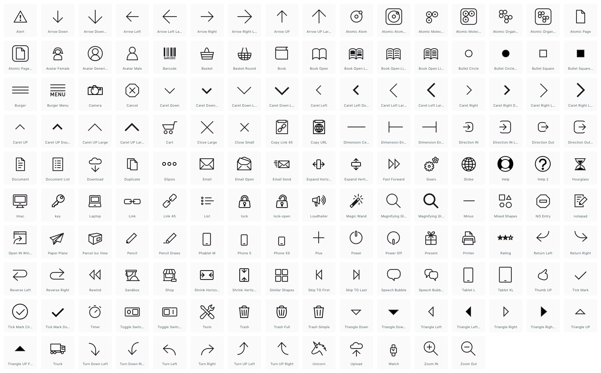

# Chocolate Icons
## A versatile icon set

### About Chocolate Icons
The Chocolate Icons are icons to be used by everyone for all kinds of projects. Starting with the **Chocolate White** set which comes in a light flavour based on lines and without fills. The icons aim to be generic and clean enough to be used in many scenarios and projects without being too strong in their own appearance. Rather than standing out these icons try to enhance and/or decorate anything from a button, a teaser, a slider.

### Overview

And why chocolate you might ask? Well, because everyone loves chocolate and it makes people happy. And so should the icons. Hope you like chocolate.

### The Basics
- designed on a 24 × 24 pixel canvas
- 1px line thickness

### Format
- svg
- iconjar (coming soon)
- png (coming soon)

### License
- The icons are provided for free (as in beer).
- Icons can be used in both personal and commercial projects.
- A link to the github project needs to be included in the credits / stylesheet comments for others to be able to find out where the icons can be obtained.
- No selling/reselling of the icons or derivative file formats.
- All rights remain with the author of the icons.
- No warranty, use at your own risk.
